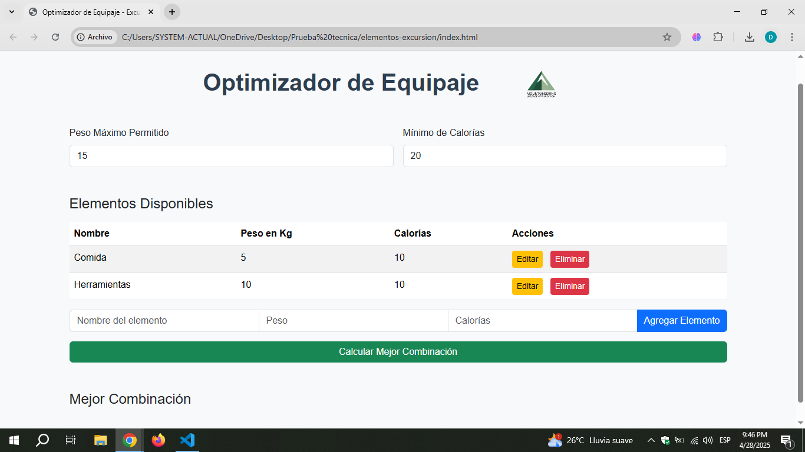

# 🧗‍♂️ Optimizador de Equipaje - Software de Excursionistas

Este proyecto permite a un grupo de excursionistas determinar el conjunto óptimo de elementos para escalar un risco, basado en:
- Calorías mínimas requeridas
- Peso máximo permitido

El sistema calcula la mejor combinación posible que cumpla los requisitos, llevando el **menor peso posible**.

---

## 🚀 Tecnologías Utilizadas

- HTML5
- CSS3 (con Bootstrap 5.3.3)
- JavaScript (Vanilla)
- LocalStorage para persistencia de datos

---

## 🎨 Características principales

- 📋 Agregar, editar y eliminar elementos con peso y calorías.
- ⚡ Calcular la combinación óptima de elementos automáticamente.
- 💾 Persistencia de datos usando el navegador (LocalStorage).
- 🌀 Spinner de carga para mejorar la experiencia de usuario.
- 📱 Diseño responsive (adaptable a móviles, tablets y escritorio).
- 📸 Integración de logo personalizado.

---

## 🛠 Cómo utilizar

1. Clona el repositorio:
    ```bash
    git clone https://github.com/DarwinPineda3/optimizador-equipaje.git
    ```
2. Abre el archivo `index.html` en tu navegador favorito.
3. ¡Empieza a agregar elementos y calcular combinaciones!

---

## 📈 Escalabilidad de la Solución

- Código modular y comentado, fácilmente adaptable para incluir:
  - API REST en backend real.
  - Base de datos persistente (MySQL, MongoDB).
  - Mejoras de algoritmos (optimización de combinaciones grandes).
- Compatible con Windows, Linux y MacOS.
- Fácilmente mantenible gracias a la separación de HTML, CSS y JS.

---

## 📷 Vista previa



---

## 📑 Estado del Proyecto

> Proyecto completado ✅  
> Listo para mejoras futuras como autenticación de usuarios, multi-excursionistas y reportes avanzados.

---

## 🧑‍💻 Autor

**Darwin Pineda**  
[GitHub](https://github.com/DarwinPineda3/optimizador-equipaje.git)

---
